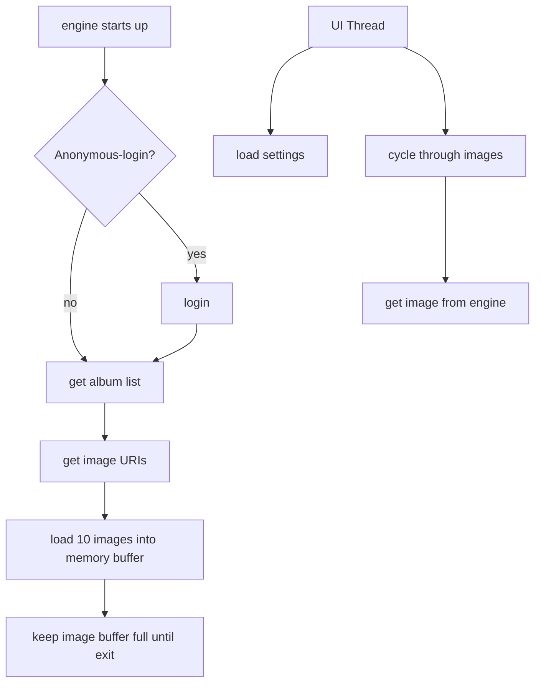

# smugScreensaver - slideshow
Andys smugmug screensaver / slideshow

Started in 2013, this code base is a hobby to build a screensaver based on a smugmug photo library
- there are some really bad software patterns, but this was started a long time ago.  There are also some interesting patterns I like, for example the SMEngine.
- major updates performed in 2018, and then 2022 as the API changed.
- the slideshow functionality replaced the screensaver bits after some windows updates seemed to alter my ability to run easily in screensaver mode, so I removed the ability to run as a screensaver in 2022.  

5/7/22:  let's make the repo public! Kind of a big deal for me, I have quite a few projects I've built for work, or on the side... this is the first one I decided to take public to see how it goes.

### requirements:
- I wanted 0 hard disk usage, or at least as little as possible.  the photo URLs are loaded into memory at startup, and there is an engine that maintains about 10 images in memory at any given time.
- 3 threads:
  1. image link collection
  2. photo collection
  3. UI thread, building out the screensaver
  4. shut off at night, to reduce smugmug consumption.  
  5. reload albums at night, that way if you upload more photos - they will be pulled into the slideshow.
- there are a couple of hidden features, such as adding more accounts to the slideshow.  It's sorta hidden, because I don't personally use it - I got tired of seeing other people's pictures.

  hot keys:
  1. left/right arrow keys change photo
  2. s:  show or hide stats.  press it once, then wait for the next image to progress
  3. r:  reload the library.  useful if you want to pull in new galleries without restarting the whole app.

### System requirements
- You'll need to be running the latest .net redistributable
- you'll need a smugmug account, while it could technically run in unauthenticated mode - it's not setup for that right now.

Pre-built installer: [LINK](https://github.com/wholeCan/smugScreensaver/blob/05bc5d579d37a46d3819000c4ee752bfbabd87c6/nsisInstaller/andysScreensaverInstaller_small.exe)

### system diagram

