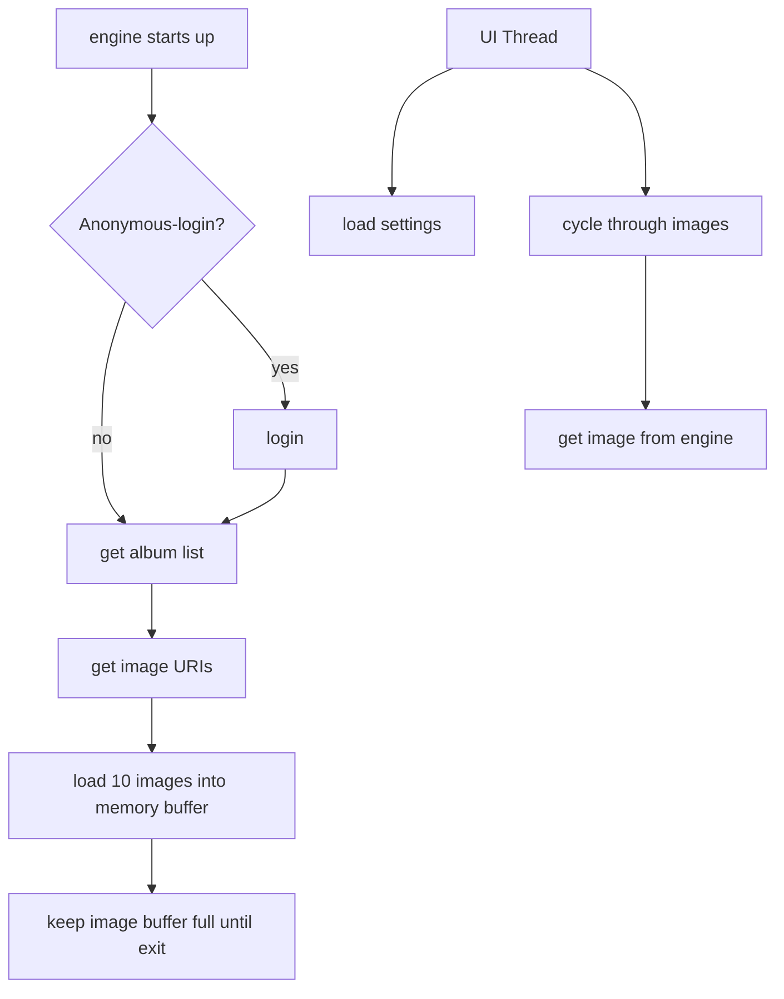

# smugScreensaver - slideshow
Andys smugmug screensaver / slideshow

Started in 2013, this code base is a hobby to build a screensaver based on a smugmug photo library
- there are some really bad software patterns, but this was started a long time ago.  There are also some interesting patterns I like, for example the SMEngine.
- major updates performed in 2018, and then 2022 as the API changed.
- the slideshow functionality replaced the screensaver bits after some windows updates seemed to alter my ability to run easily in screensaver mode, so I removed the ability to run as a screensaver in 2022.  

5/7/22:  let's make the repo public! Kind of a big deal for me, I have quite a few projects I've built for work, or on the side... this is the first one I decided to take public to see how it goes.

10/1/25: fairly extensive refactor, adding video support, and some other features along with upgrading dotnet version.

4/17/26: telemetry and tracker improvements, enhanced reload logic.

### requirements:
- I wanted 0 hard disk usage, or at least as little as possible. The photo URLs are loaded into memory at startup, and there is an engine that maintains about 10 images in memory at any given time.
- 3 threads:
  1. image link collection
  2. photo collection
  3. UI thread, building out the screensaver
- shut off at night to reduce smugmug consumption
- reload albums at night, so newly uploaded photos are pulled into the slideshow
- there are a couple of hidden features, such as adding more accounts to the slideshow.  It's sorta hidden, because I don't personally use it - I got tired of seeing other people's pictures.

### Hotkeys
- **Left/Right arrow keys** — change photo
- **S** — show or hide stats (press once, then wait for the next image to progress)
- **R** — reload the library (useful for pulling in new galleries without restarting)

### System requirements
- You'll need to be running the latest .net redistributable
- you'll need a smugmug account, while it could technically run in unauthenticated mode - it's not setup for that right now.

### Installation
The easiest way to run smugScreensaver is with the pre-built installer: [LINK](nsisInstaller/andysScreensaverInstaller_small.exe)

If you want to build from source, you'll need to obtain your own smugmug API credentials.

### system diagram

```mermaid
  flowchart TD
    engine[engine starts up]-->anonymous{Anonymous-login?}
    anonymous-- no --> getAlbums
    anonymous-- yes --> login[login]
    login-->getAlbums[get album list]
    getAlbums-->getURIs[get image URIs]
    getURIs-->loadImages[load 10 images into memory buffer]
    loadImages-->keepFull[keep image buffer full until exit]
    UI-thread[UI Thread]-->load[load settings]
    UI-thread-->cycle[cycle through images]
    cycle-->getImageFromEngine[get image from engine]
```

### Notes
- vlc libs are currently manually copied in to the build environment, and included in the installer.
